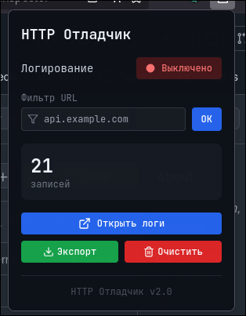
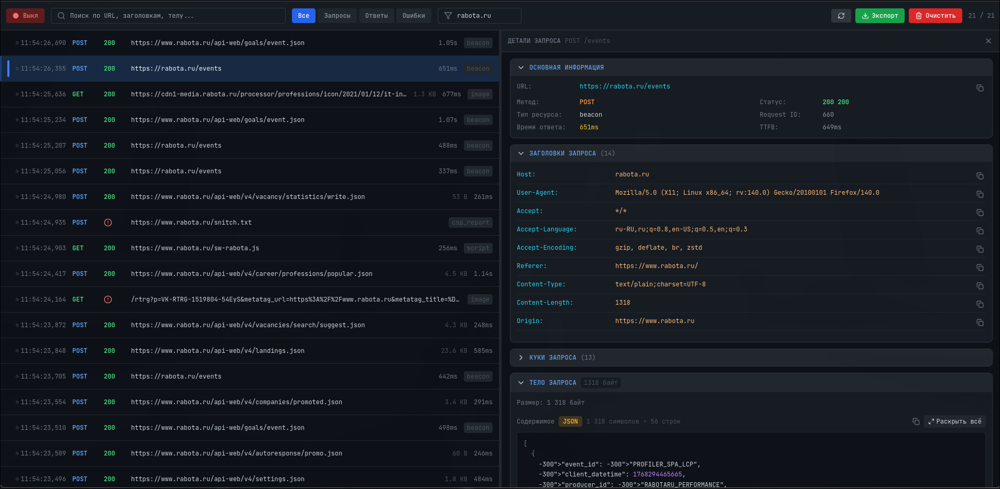

# Firefox HTTP Inspector

Расширение Firefox для перехвата и анализа HTTP запросов/ответов. Сохраняет логи в постоянное хранилище, что позволяет не терять данные при редиректах и перезагрузках страниц.

**[⬇️ Скачать последнюю версию](https://github.com/mixelka75/firefox-http-inspector/releases/latest)**

## Скриншоты

<p align="center">
  
  
</p>

## Зачем это нужно?

**Проблема DevTools:** Стандартный Network панель в Firefox DevTools очищается при каждом редиректе или переходе на другую страницу. Это критично при отладке OAuth-авторизации, платёжных шлюзов и любых flow с множественными редиректами.

**Решение:** Firefox HTTP Inspector сохраняет ВСЕ запросы в `browser.storage.local`, они не теряются при навигации и доступны в отдельной вкладке.

## Ключевые возможности

- **Персистентное хранение** — логи сохраняются между редиректами и перезагрузками
- **Полный перехват** — тела запросов и ответов, заголовки, куки
- **Бинарные данные** — поддержка grpc-web, protobuf, любых бинарных форматов
- **Protobuf декодер** — автоматическое определение и парсинг protobuf сообщений
- **Real-time обновления** — страница логов обновляется в реальном времени
- **Base64 + текст** — данные отображаются в обоих форматах
- **Фильтрация** — по URL, типу ресурса, методу запроса
- **Экспорт в JSON** — для дальнейшего анализа

## Сравнение с DevTools

| Функция | DevTools | HTTP Inspector |
|---------|----------|----------------|
| Сохранение при редиректах | Нет | Да |
| Сохранение при закрытии вкладки | Нет | Да |
| Protobuf декодирование | Нет | Да |
| Экспорт в JSON | HAR (сложный формат) | Простой JSON |
| Фильтр по URL | Да | Да |
| Real-time | Да | Да |

## Установка

### Временная установка (для разработки)

1. Склонируйте репозиторий:
```bash
git clone https://github.com/mixelka75/firefox-http-inspector.git
cd firefox-http-inspector
```

2. Установите зависимости и соберите:
```bash
npm install
npm run build
```

3. Откройте Firefox и перейдите на `about:debugging#/runtime/this-firefox`

4. Нажмите "Загрузить временное дополнение" и выберите файл `dist/manifest.json`

### Постоянная установка

Создайте .xpi архив:
```bash
cd dist
zip -r ../http-inspector.xpi *
```

Затем установите через `about:addons` → шестерёнка → "Установить дополнение из файла"

## Использование

### Popup расширения


1. Нажмите на иконку расширения в панели инструментов
2. Включите/выключите логирование переключателем
3. Задайте фильтр URL для перехвата только нужных запросов
4. Нажмите "Открыть логи" для просмотра всех запросов

### Страница логов


- **Левая панель** — список всех перехваченных запросов с URL, методом и статусом
- **Правая панель** — детали выбранного запроса: заголовки, тело запроса/ответа
- **Подсветка синтаксиса** — автоматическое форматирование JSON и других форматов
- **Protobuf декодер** — автоматический парсинг protobuf сообщений в читаемый формат

### Фильтрация

- **По URL**: введите часть URL (например `api.example.com`)
- **По типу**: в списке логов можно фильтровать по типу ресурса
- **По методу**: фильтр по HTTP методу (GET, POST, etc.)

### Экспорт

Нажмите "Экспорт" в popup для сохранения всех логов в JSON файл.

## Технические детали

### Как перехватываются данные

1. **webRequest API** — основной метод перехвата через `browser.webRequest.filterResponseData()`
2. **Content Script** — fallback для случаев когда webRequest не работает (CORS, cached)

### Структура проекта

```
firefox-http-inspector/
├── src/
│   ├── components/      # React компоненты
│   ├── hooks/           # React хуки
│   ├── utils/           # Утилиты (protobuf декодер)
│   ├── LogsApp.jsx      # Страница логов
│   └── PopupApp.jsx     # Popup расширения
├── background.js        # Service worker
├── content.js           # Content script
├── manifest.json        # Манифест расширения
└── dist/                # Собранное расширение
```

### Сборка для разработки

```bash
npm run dev      # Запуск dev сервера
npm run build    # Production сборка
```

## Требования

- Firefox 57+ (WebExtensions API)
- Node.js 16+ (для сборки)

## Лицензия

MIT

## Благодарности

- [pawitp/protobuf-decoder](https://github.com/pawitp/protobuf-decoder) — логика декодирования protobuf
